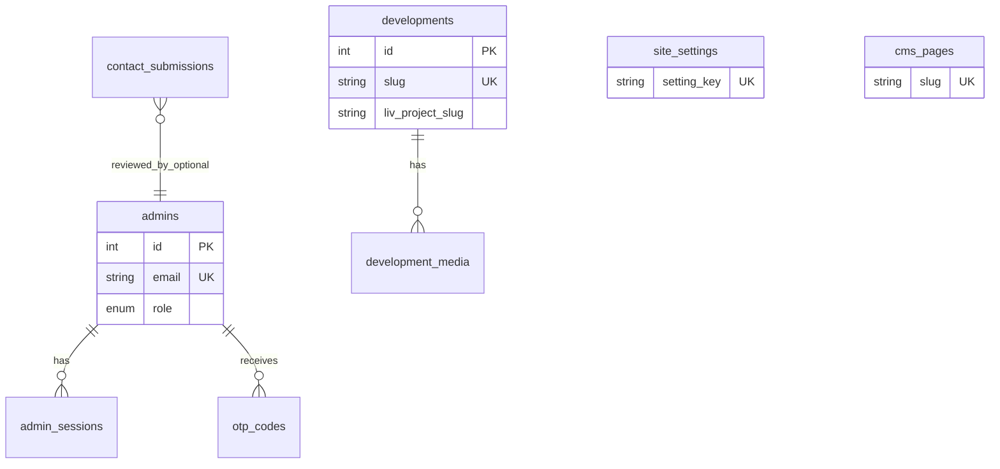

# Capital Urbano — MySQL schema proposal

**Target stack:** Banahosting shared hosting, **MariaDB 11.4**, **PHP 8.4.21** with **mysqlnd**, same deployment model as [liv-capital](https://github.com/your-org/liv-capital).

## Relationship to LIV Capital

| Site | Role | Data focus |
|------|------|------------|
| **capitalurbano.com** | Corporate **desarrolladora** brand | Portfolio of vertical developments, company story, quality pillars, leadership, contact |
| **livcapitalgdl.mx** | Single **building / product** site | Apartment models, amenities, visit booking, Matterport, POIs |

Same ownership (Capital Urbano grupo). Keep **separate databases** (`capital_urbano` vs `liv_capital`) for isolation and simpler deploys. Link projects via `developments.liv_project_slug` or `external_site_url` when a development has its own LIV microsite.

Admin OTP auth reuses the **same pattern** as liv-capital (`admins`, `admin_sessions`, `otp_codes`) — not shared tables unless you later add a central SSO.

## Entity overview



## Tables (phase 1 — `2026_001_initial.sql` + `2026_002_newsletter_faq_clients.sql`)

### Auth (identical pattern to liv-capital)

| Table | Purpose |
|-------|---------|
| `admins` | Panel users (`superadmin` / `admin`) |
| `admin_sessions` | Bearer tokens stored as SHA-256 hash, 7-day TTL |
| `otp_codes` | 6-digit OTP hashes, 10 min TTL, `context_type = admin_login` |

### Corporate CMS

| Table | Purpose |
|-------|---------|
| `site_settings` | Key-value config (public flags for `/api/site-config`) |
| `developments` | Portfolio projects (Punto Sao Paulo, Vista Magna, Torres Myth, …) |
| `development_media` | Gallery / video per development |
| `development_amenities` | Per-project amenities with optional image (admin-managed; independent of LIV feed) |
| `development_models` | Per-project apartment tipologías with image (admin-managed) |
| `quality_pillars` | Homepage “pilares de calidad” blocks |
| `team_members` | Leadership & team (e.g. Gilberto Cordero) |
| `cms_pages` | Markdown pages: `about`, `quality`, `experience`, legal |
| `contact_submissions` | Contact form inbox; links to `clients` + optional `development_id` |
| `newsletter_subscribers` | Footer / contact “Mantente actualizado” opt-in |
| `faq_items` | Structured FAQ for **Contact** page (accordion) |
| `cms_content` | Legal markdown (`privacy_policy`, `terms_and_conditions`) |
| `clients` | CRM — dedupe by email; ties contact + newsletter |

### `developments` — general project info (desarrollo)

Extended columns (migration `2026_002`):

| Column | Purpose |
|--------|---------|
| `description` | Long copy for project detail |
| `address_line`, `city`, `state` | Location |
| `delivery_estimate` | e.g. “Q4 2027” |
| `total_floors`, `total_units` | Scale |
| `brochure_url`, `highlights` (JSON) | Assets / bullet list |
| `contact_email`, `contact_phone` | Per-project sales line |
| `liv_project_slug`, `external_site_url` | Link to LIV or microsite |
| `latitude`, `longitude` | WGS84 map pin (migration `2026_005`) |

`GET /api/developments?slug=punto-sao-paulo` returns full detail; list endpoint returns summary.

**Portfolio map:** `GET /api/developments?map=1` → `{ center, markers }`. Default center from `site_settings.map_lat` / `map_lng`.

### Ops

| Table | Purpose |
|-------|---------|
| `schema_migrations` | Created by `database/migrate.php` |

## Public API map

| Endpoint | Feature |
|----------|---------|
| `POST /api/newsletter` | Footer “OK” subscribe |
| `GET /api/faq` | FAQ list (`?category=contacto` optional) |
| `GET /api/contact-page` | Contact page bundle (settings + FAQ + developments) |
| `POST /api/contact` | Form + `clients` upsert + optional newsletter |
| `GET /api/developments` | Portfolio list, `?slug=` detail, or `?map=1` for map markers |

## Phase 2 (optional, not migrated yet)

| Table | Purpose |
|-------|---------|
| `press_releases` | News / comunicados |
| `career_openings` | Bolsa de trabajo |
| `email_logs` | SMTP audit trail (like liv-capital) |
| `media_library` | Shared uploads index |

## Differences from liv-capital schema

| liv-capital | capital-urbano |
|-------------|----------------|
| `apartment_models`, `model_images` | `developments`, `development_media` |
| `amenities`, `points_of_interest` | `development_amenities` (corporate portfolio); POIs stay on LIV |
| `visit_bookings`, `visit_slot_*` | N/A (corporate site; visits per product site) |
| `building_config` | `site_settings` |
| `clients` CRM | **Implemented** — shared pattern with liv-capital |

## PDO / mysqlnd notes (PHP 8.4.21)

- Use **native prepared statements** (`PDO::ATTR_EMULATE_PREPARES => false`) — already in `_headers.php` / `admin/_init.php`.
- Charset **`utf8mb4`** + `utf8mb4_unicode_ci` for Spanish copy and emoji-safe content.
- JSON columns (if added later) rely on MariaDB `JSON_VALID` checks like liv-capital.
- No MySQL 8-only features; compatible with MariaDB 11.4 on Banahosting.

## Apply schema

```bash
# From project root, with DB_* env vars or interactive prompts:
npm run db:migrate

# Or import database/schema.sql in phpMyAdmin (includes DDL + mock seeds at the end).
```

### Mock data (`2026_003_mock_seed_data.sql`)

For **local/staging testing** only. Seeds empty tables with demo content:

| Table | Mock includes |
|-------|----------------|
| `developments` | Full copy, highlights JSON, contact lines, hero paths |
| `development_media` | Placeholder `/uploads/...` images + sample video |
| `quality_pillars` | 4 homepage pillars |
| `team_members` | Gilberto Cordero + 3 team profiles |
| `cms_pages` | Published markdown for about/quality/experience/contact |
| `clients` | 5 CRM leads (`*@example.com`) |
| `contact_submissions` | 4 inbox rows (new/read/archived) |
| `newsletter_subscribers` | 3 subscribers |
| `site_settings` | Stats, WhatsApp, map coords |
| `admins` | `admin@capitalurbano.test` (superadmin) — **change before production** |

Re-run safe: uses `NOT EXISTS` / `ON DUPLICATE KEY` where possible.

## First superadmin

After migration, insert an active admin in phpMyAdmin:

```sql
INSERT INTO admins (name, email, role, is_active)
VALUES ('Your Name', 'you@company.com', 'superadmin', 1);
```

Login at `/admin/login` — OTP email uses SMTP from `_config.php`.
